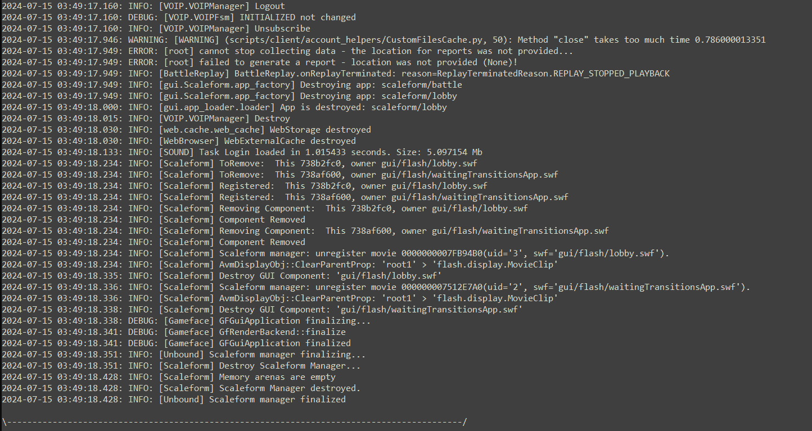
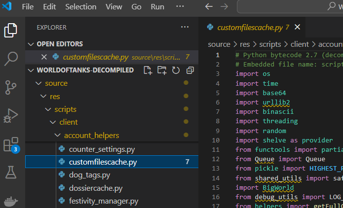

# World of Tanks Simple Modmaker Guide

A barebones guide for the essential processes to mod World of Tanks.

This guide will assume limited knowledge and and will cover the most basic process possible to create a mod for World of Tanks.

I'm creating this barebones guide because I could hardly find any documentation online for modding the game scripts.

If you find this guide useful, please consider giving the repo a star so that it can be more easily found by others.

> [!NOTE]  
> This guide will cover only scripting changes to the games files and packaging a mod.

> [!WARNING]  
> This DOES NOT cover 3D modeling, texturing, or sound editing.

# Requirements

- [Python 2.7.18](https://www.python.org/downloads/release/python-2718/)
- A copy of World of Tanks installed
- A text editor. I recommend [Visual Studio Code](https://code.visualstudio.com/)
- Some time :)
- A basic understanding of Python and programming concepts is helpful but not strictly required in the age of AI.
- Git to be installed on your system. You can download it [here](https://git-scm.com/downloads)
- A few git commands
- A few lines in a terminal

# Step 1: Decompiling the game files

Instead of working with the compiled game files, we will be working with the decompiled files. Decompiled means that the files have been converted from the compiled format back to a human-readable format again.

I recommend using StranikS-Scan's decompiled files. You can find them [here](https://github.com/StranikS-Scan/WorldOfTanks-Decompiled).

## Clone the decompiled files to your system

Open a terminal and navigate to the directory where you want to clone the repository.

```bash
git clone https://github.com/StranikS-Scan/WorldOfTanks-Decompiled
```

> [!NOTE]  
> This repo is quite large, so it may take some time to download.

## Create a new repo to store your mod

Create a new repository on GitHub. You can find instructions [here](https://docs.github.com/en/github/getting-started-with-github/create-a-repo).

You will want somewhere to store your mod files. You can use GitHub or any other git hosting service.

Once you got a repo clone that one down to your system as well.

```bash
git clone my-repo-url
```

# Step 2: Making a very simple change

Let's make a very simple change to the game files to get started. It should be something easy to find and easy to change.

Lets just add a warning log that will be written to the games python.log file.

If you open up your installed game directory and look in the root there will be a file called python.log. This file is used to log errors and warnings from the game's python scripts.

If you open it you should see something like this:



It doesn't matter what we change, just that we change something somewhere.

## Find a file to change

I'll use the file `scripts/client/account_helpers/customfilescache.py` as my example.

Navigate to the file in the decompiled files and open it in your text editor.



## Copy that file to your mod repo

We will now copy this file in its entirety to our mod repo.

> [!NOTE]  
> You must match the name and directory structure of the file in the decompiled files exactly.

You can see an example I made in the example-mod-code folder.

This is now the file that we will be changing. NOT the file in the decompiled files repo.

## Make a small modification

There are some log functions in the file that look like this:

```python
from debug_utils import (
    LOG_WARNING,
    LOG_ERROR,
    LOG_CURRENT_EXCEPTION,
    LOG_DEBUG,
    LOG_DEBUG_DEV,
)
```

We will add a warning log to the `__init__` function of the CustomFilesCache class.

```python
class CustomFilesCache(object):
    def __init__(self, cacheFolder):

        LOG_WARNING('wot-simple-modmaker-guide: CustomFilesCache __init__ called')

        prefsFilePath = unicode_from_utf8(BigWorld.wg_getPreferencesFilePath())[1]
        self.__cacheDir = os.path.join(os.path.dirname(prefsFilePath), cacheFolder)
        self.__cacheDir = os.path.normpath(self.__cacheDir)
        self.__mutex = threading.RLock()
        self.__cache = {}
        self.__accessedCache = {}
        self.__processedCache = {}
        self.__written_cache = set()
        self.__db = None
        self.__prepareCache()
        self.__worker = ThreadPool()
        self.__worker.start()
        self.__startTimer()
        return
```

# Step 3: Packing the mod

We will now pack the mod into a .wotmod format that the game can read.

## Setup the packing script

We will use LockBlock-dev's auto-packer script to do this. You can find it [here](https://github.com/LockBlock-dev/wot-mods/tree/master/auto-packer)

Make a file called `packer.py` in your mod repo and copy the contents of the script into it.

## Run the packing script

Open a terminal and navigate to your mod repo.

> [!WARNING]  
> The script must be run using a Python 2.7 interpreter. Install it from the requirements section if you haven't already.

Run the script using the following command:

```bash
your-python-2.7-interpreter packer.py
```

The path to your interpreter may vary depending on your system.
It might look something like this, depending on where you installed it:

```bash
C:\Python27\python.exe packer.py
```

The script will create a .wotmod file in the build directory of your mod repo. You can pass arguments to the script to change the name of the .wotmod file with versions etc.

# Step 4: Install the mod

Copy the .wotmod file to your game's mods directory in the latest game version folder.

Launch the game and log in to make sure your change will be executed.

> [!NOTE]  
> If the game hangs/crashes, you may have made a mistake in the code. Check the python.log file for errors. If you can't find the error, you can always delete the mod from the mods directory and follow the steps again to generate a new one.

# Step 5: Verify your mod worked

Open the python.log file in the game directory and search for the log message you added.

If you see it, congratulations! You have successfully created a mod for World of Tanks 🎉🎉

If you don't see it and there are no obvious crashes, you may have placed the log in some script that is not being executed. Try placing the log in a different location. Maybe beside another log that you know is being executed.

# Conclusion

This guide is a very basic introduction to modding World of Tanks. It is meant to be a starting point for those who are interested in modding the game but don't know how to get started.

You should now have the basic tools and knowledge to start creating your own mods for World of Tanks.

If you think there is something missing from this guide or there might be an error, please let me know by creating an issue on the repo or a PR to correct it.

# Credits

StranikS-Scan for the decompiled game files
https://github.com/StranikS-Scan/WorldOfTanks-Decompiled

LockBlock-dev for the packing script
https://github.com/LockBlock-dev/wot-mods/tree/master/auto-packer
